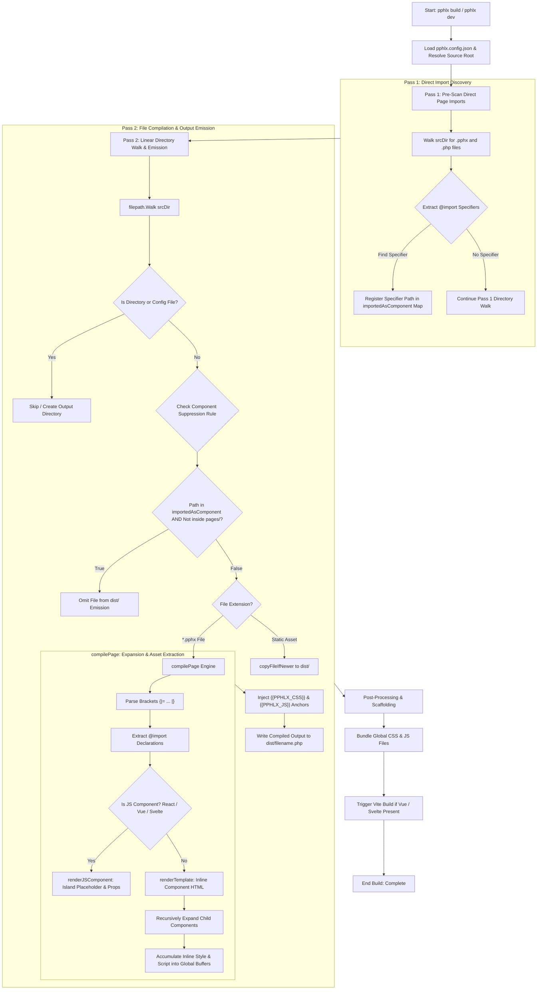
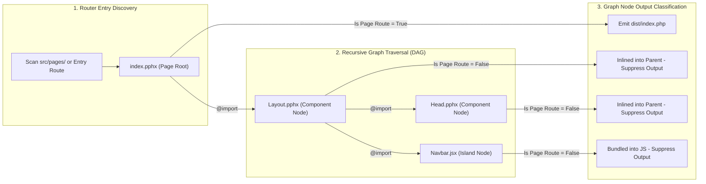

# PPHLX Compiler Architecture: Current Execution Flow & DAG Invariants

This document outlines the current compilation pipeline in `pphlx-core/main.go` and specifies the architectural transition from **Linear Directory File Walking** to **DAG Page-Rooted Dependency Graph Traversal**.

---

## 📊 Current Go Compiler Pipeline (`pphlx-core/main.go`)

The diagram below illustrates the exact current logic executed during `pphlx build` / `pphlx dev`:



---

## ⚠️ Known Limitation in Current Pass 1 Pre-Scanner

```
[src/index.pphx]  ──(@import)──>  [src/layouts/Layout.pphx]  ──(@import)──>  [src/components/Head.pphx]
      │                                    │                                      │
   Scanned                              Scanned                             NOT SCANNED
 (Direct Import)                    (Direct Import)                       (Nested Child)
      │                                    │                                      │
   Marked in                            Marked in                              UNMARKED in
importedAsComponent                  importedAsComponent                  importedAsComponent
```

### 🔴 The Leak Symptom:
1. `index.pphx` imports `Layout.pphx`.
2. Pass 1 marks `Layout.pphx` in `importedAsComponent`.
3. `Layout.pphx` imports `Head.pphx`. Pass 1 **does not recursively inspect imports inside child components**.
4. During Pass 2 (`filepath.Walk`), `Head.pphx` is encountered. Because `importedAsComponent["Head.pphx"]` is `false`, the compiler misidentifies `Head.pphx` as an independent page route and writes `dist/components/Head.php`.

---

## 🎯 Proposed DAG Page-Rooted Graph Traversal Specification

To mirror the component suppression model used by Astro, Vite, and Next.js:



### 📐 Invariant Specification Rules:
1. **Entry Graph Traversal**: Recursively follow all `@import` paths starting strictly from Page Routes (`src/pages/` or `pphlx.config.json` entry file).
2. **Component Marking**: Every specifier encountered during graph traversal is marked as an **Inlined Component Node**.
3. **Strict Standalone Omission**: Files that are reachable ONLY as imported component nodes within page graphs are **100% omitted** from `dist/` standalone file output.
